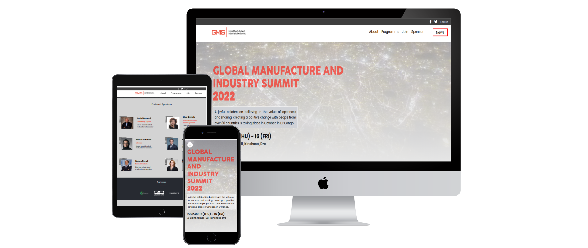

# Global Manufacture and Industry Summit 2022
 
* In this capstone project I build a project based on an online website for a conference.I have been given design guidelines to create the website (design guidelines), I had personalized the content,though I built the website based on the content of a Global Manufacture and Industry Summit 2022 conference , even the content is based on that.



## Built With

* HTML
* CSS
* Javascript 
 
## Getting Started

**This is an example of how you may give instructions on setting up your project locally.**

Make sure you have the ```HTML CSS and JavaScript``` linters computer.

To get a  copy of my Project on you local storage , you have to follow these simple example steps.

* copy this link ```https://github.com/iambenkis/Global-summit-GMIS-.git```
* Get the directory that you want to clone the repository.
* Open the command prompt in this directory.
* Clone by using this command : ```git clone https://github.com/iambenkis/Global-summit-GMIS-.git```
* Got to the cloned folder in your prompt command using ```cd folder_name```
* Run the code 

### Prerequisites  
Figma HTML CSS JavaScript

### Setup

* git
* github 
* VsCode 
* Figma (Optional)

### Install

Install linters by following this step :

1. In the first commit of your feature branch create a .github/workflows folder and add a copy of ```.github/workflows/linters.yml``` to that folder.
2. Do not make any changes in config files  
3. TYou can create a ```.gitignore``` file and add ```node_modules```
4. To install ```Webhint``` linters run:
    * ```npm init -y```
    * ```npm install --save-dev hint@7.x```
5. To install ```Stylelint``` linters run :
    * ```npm install --save-dev stylelint@13.x stylelint-scss@3.x stylelint-config-standard@21.x stylelint-csstree-validator@1.x```
6. Ti Install ```ESLint``` run :
    * ```npm install --save-dev eslint@7.x eslint-config-airbnb-base@14.x eslint-plugin-import@2.x babel-eslint@10.x```
 
### Usage

* Visit the github repository and clone 
* Start  editing using your local development environment

## Live Demo 

* [Live demo](https://iambenkis.github.io/Global-summit-GMIS-/)
* [Video capture](https://www.loom.com/share/16f1311b74ae468aa38fc947474ccafd)

## Authors

👤  **Benjamin Kisenge**

* GitHub: [@benjamin kisenge](https://github.com/iambenkis)
* Twitter: [@benjamin kisenge](https://twitter.com/iambenkis)
* LinkedIn: [benjamin kisenge](https://www.linkedin.com/in/ben-kisenge/)

## 🤝 Contributing

Contributions, issues, and feature requests are welcome!

Feel free to check the [issues page](../../issues/).

## Show your support

Give a ⭐️ if you like this project!

## Acknowledgments

* [ Cindy Shin](https://www.behance.net/gallery/29845175/CC-Global-Summit-2015) whom design was used as a template.

## 📝 License

This project is [MIT](./MIT.md) licensed.